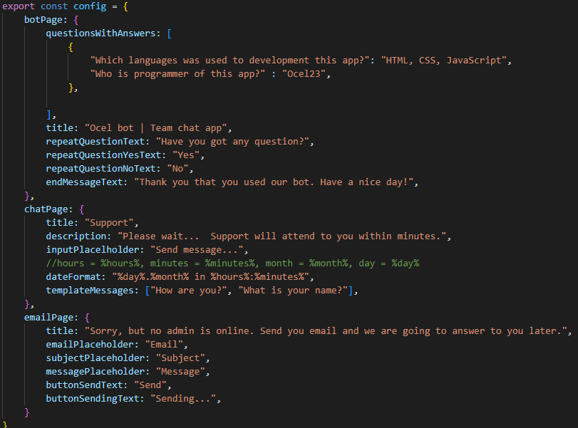

<h1>Chat aplication template with Chat Bot</h1>

<h2>Informations:</h2>
<p>I present to you my first post on my github. This is a template that the user can deploy on any website.</p>
<p>The application contains a config that the user can configure as desired. The application was created using React and NodeJS technologies, it only supports <strong>MongoDB</strong> so far.</p>
<p>You can find a sample application to try at <a href="#chat-aplication-tempalte-with-chat-bot">this link</a>.</p>

> [!WARNING]
> <strong>The code cannot be further modified without the consent of the owner.</strong> Only config.js and env files.<br>

<p>If you have any questions, feel free to write to my email or discord. I wish you a great use :yum:.</p>

<h3>Process</h2>


1. Upload the Client and Server to your hosting services.
2. Setup .env files variables.
3. Adjust the config for your needs.
4. Lets go to installation!

<h3>1. Hosting</h3>

<p>For hosting your app, you can use anything, you want, if you have low budget then you can host your app on render(i recommend)</p>

### 2. Setup .env files variables

##### List of used variables for client

+ REACT_APP_NODEJS_ADDRESS

##### List of used variables for server

+ MONGO_DB_ADDRESS=
+ NODEJS_HOST_DEPLOY_ADDRESS=
+ NODEJS_BE_ADDRESS=
+ PORT_OF_SERVER=
+ EMAIL_HOST_ADDRESS=
+ EMAIL_HOST_PORT=
+ EMAIL_HOST_SECURE=
+ EMAIL_POOL=
+ EMAIL_AUTH_USERNAME=
+ EMAIL_AUTH_PASSWORD=
+ TLS_REJECT=
+ USER_EMAIL_ADDRESS=

<h3>3. Adjust the config for your needs</h3>

<details>
    <summary>Config code</summary>
    </img>
</details>


<h3>4. Installation</h3>

#### Client

<p>First you need to install all depensies</p>

```
npm i
```

<p>Then only write</p>

```
npm start
```

<p>And it is all! Congratulations, we now have a client running!</p>


#### Server

<p>First you nedd to install all depensies</p>

```
npm i
```

<p>For first use our app we must write one command for setup our app (this command only write once)</p>

```
node index.js setup
```

<p>Then we must register for manage your app (this is how you can register every administrator of this application)</p>

```
node index.js register --email <your email> --password <your password>
```

<p>And it is all! Congratulations, we now have a server running!</p>

#### Adding to the html page

<p>For put our app to your html page we use html tag ```iframe```</p>

<p>Then you must create class for this tag with this properties</p>

<details>
    <summary>Example</summary>

    ```html
        <iframe src="http://localhost:3000" class="app"></iframe>  
    ```

</details>


