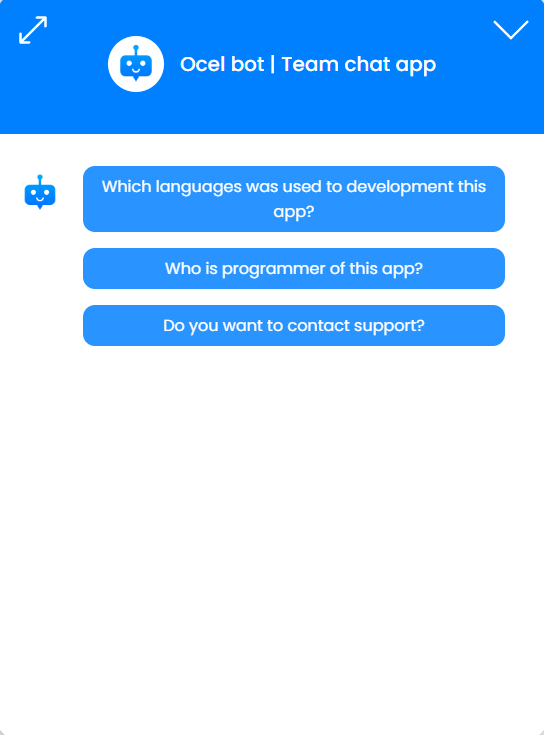

<h1>Chat aplication template with Chat Bot</h1>

</img>

<h2>Informations:</h2>
<p>I present to you my first post on my github. This is a template that the user can deploy on any website.</p>
<p>The application contains a config that the user can configure as desired. The application was created using React and NodeJS technologies, it only supports <strong>MongoDB</strong> so far.</p>
<p>You can find a sample application to try at <a href="https://chat-app-template.onrender.com/">this link</a>.</p>

> [!WARNING]
> <strong>The code cannot be further modified without the consent of the owner.</strong> Only config.js and env files.<br>

<p>If you have any questions, feel free to write to my email or discord. I wish you a great use :yum:.</p>

<h3>Process</h2>

1. Upload the Client and Server to your hosting services.
2. Setup .env files variables.
3. Adjust the config for your needs.
4. Lets go to installation!

<h3>1. Hosting</h3>

<p>For hosting your app, you can use anything, you want, if you have low budget then you can host your app on render(i recommend)</p>

### 2. Setup .env files variables

##### List of used variables for client

+ REACT_APP_NODEJS_ADDRESS=_adress of node js api for BE_

##### List of used variables for server

+ MONGO_DB_ADDRESS=_adress of mongo db_
+ NODEJS_HOST_DEPLOY_ADDRESS=_adress of deployed app_
+ NODEJS_BE_ADDRESS=_adress of ndoe js api for BE_
+ PORT_OF_SERVER=_port of node js server_
+ EMAIL_HOST_ADDRESS=_address of email hosting_
+ EMAIL_HOST_PORT=_email host port_
+ EMAIL_HOST_SECURE=_if email secure(true/false)_
+ EMAIL_POOL=_if pool(true/false)_
+ EMAIL_AUTH_USERNAME=_email username_
+ EMAIL_AUTH_PASSWORD=_email auth password_
+ TLS_REJECT=_if is Transport Layer Security(true/false)_
+ USER_EMAIL_ADDRESS=_e-mail address for receiving e-mails
+ SESSION_SECRET=secret for session

<h3>3. Adjust the config for your needs</h3>

<details>
    <summary>Config code</summary>
    </img>
</details>


<h3>4. Installation</h3>

#### Client

<p>First you need to install all depensies</p>

```
npm i
```

<p>Then only write</p>

```
npm start
```

<p>And it is all! Congratulations, we now have a client running!</p>


#### Server

<p>First you nedd to install all depensies</p>

```
npm i
```

<p>For first use our app <strong>we must write one command for setup our app (this command only write once)</strong></p>

```
node index.js setup
```

<p><strong>Then we must register for manage your app (this is how you can register every administrator of this application)</strong></p>

```
node index.js register --email <your email> --password <your password>
```

<p>And it is all! Congratulations, we now have a server running!</p>

#### Adding to the html page

<p>For put our app to your html page we use html tag</p> 

```iframe```

<p>Then you must create class for this tag with this properties</p>

<details>
    <summary>Example</summary>

    <iframe src="http://localhost:3000" class="app"></iframe>

    <style>
        .app {
            border: 0;
            position: fixed;
            width: 100%;
            height: 100%;
        }
    </style>
</details>

<p>The app also includes a vanilla html test file with css.</p>

<p><strong>Congratulations, you already know everything you need, use the application!</strong><p>

> [!NOTE]
> <strong>If you want to me support for next cool project that you can </strong><a href="https://www.buymeacoffee.com/ocel23">buy me a coffee🍮</a>.

<p>If you want to me contant that i am active in <a href="#">discord</a>.

<p>Also i would like that you share my app with your friends.</p>

<a href="Chat app.pdf">Here you can download preview of app in pdf</a>


